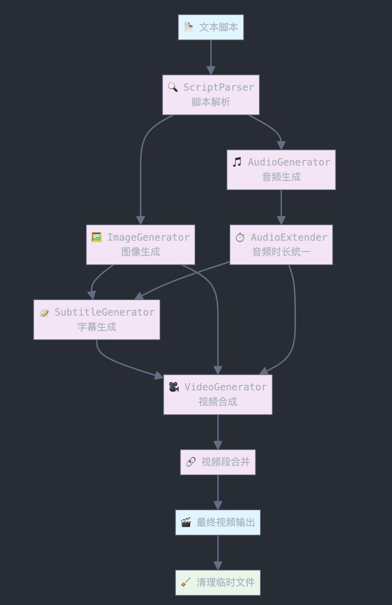

<div align=center>
  <h1>AI 视频生成工具</h1>
  <p>中文 | <a href="./README-en.md">English</a></p>
</div>

一个基于 OOMOL Blocks 构建的多个 AI 服务的自动化视频生成工具，可以从文本脚本自动生成包含图像、音频、字幕的完整视频。

## ✨ 特性

- 🎬 **脚本解析**: 自动解析结构化文本脚本，提取场景信息
- 🖼️ **AI 图像生成**: 基于视觉提示自动生成场景图像
- 🎵 **AI 语音合成**: 将解说词转换为高质量语音
- 📝 **智能字幕**: 自动生成多格式字幕文件（SRT/ASS/VTT）
- 🎥 **视频合成**: 使用豆包 AI 将图像转换为视频，并合成音频字幕
- ⚡ **批量处理**: 支持多场景批量生成和合并
- 🔧 **精确时长控制**: 音频扩展到指定时长，确保视频同步

## 🚀 快速开始

### 安装

1. 社区搜索 `story-to-book`
2. 安装插件
3. `Use` 该插件
4. 在 converter flow 中输入文档

### 配置 API 密钥

创建配置文件或环境变量：

```typescript
const config = {
  // 图像生成 API（OOMOL）
  imageConfig: {
    apiKey: "your-oomol-api-key",
    apiEndpoint: "https://console.oomol.com/v1/images/generations",
    model: "doubao-seedream-3-0-t2i-250415",
    size: "720x1280"
  },
    
  // 视频生成 API (豆包，Doubao-Seedance-1.0-lite-i2v 大模型)
  videoConfig: {
    apiKey: "your-doubao-api-key",
    size: "1280x720",
    format: "mp4"
  },
  
  // 语音合成 API。当前使用 ohMyGPT tts-1 大模型
  audioConfig: {
    apiKey: "your-tts-api-key",
    apiEndpoint: "https://cn2us02.opapi.win/v1/audio/speech",
    model: "tts-1",
    voice: "alloy"
  }
};
```

**OOMOL AI**

* `imageConfig` `API_KEY` [生成地址](https://console.oomol.com/panel/api-key)

**豆包 AI**

* `API_KEY` [生成地址](https://console.volcengine.com/ark/region:ark+cn-beijing/apiKey?apikey=%7B%7D)
* `videoConfig` 开通图生视频大模型：[Doubao-Seedance-1.0-lite-i2v](https://console.volcengine.com/ark/region:ark+cn-beijing/openManagement?LLM=%7B%7D&OpenTokenDrawer=false&tab=ComputerVision)

**ohMyGPT**

* `audioConfig` 的 `API_KEY` [生成地址](https://www.ohmygpt.com/apis/keys)


## 📁 项目结构

```
src/
├── ScriptParser.ts      # 脚本解析器
├── ImageGenerator.ts    # 图像生成器
├── AudioGenerator.ts    # 音频生成器
├── AudioExtender.ts     # 音频扩展器
├── SubtitleGenerator.ts # 字幕生成器
├── VideoGenerator.ts    # 视频生成器
├── FFmpegExecutor.ts    # FFmpeg 基础类
└── constants.ts         # 类型定义和常量
```

### 🏗️ 架构设计

```
文本脚本 → 脚本解析 → 图像生成 → 音频生成 → 音频扩展 → 字幕生成 → 视频生成 → 视频合并
```



### 核心模块

| 模块 | 功能 | 输入 | 输出 |
|------|------|------|------|
| `ScriptParser` | 解析脚本文件 | 结构化文本 | 场景数据 |
| `ImageGenerator` | 生成场景图像 | 视觉提示 | 图像文件 |
| `AudioGenerator` | 生成语音 | 解说词文本 | 音频文件 |
| `AudioExtender` | 扩展音频时长 | 音频文件 | 标准时长音频 |
| `SubtitleGenerator` | 生成字幕 | 文本内容 | 字幕文件 |
| `VideoGenerator` | 生成最终视频 | 所有资源 | 完整视频 |

## 🆘 支持

如果遇到问题或需要帮助：

- 📧 邮箱: honeysyt@gmail.com
- 🐛 问题反馈: [GitHub Issues](https://github.com/oomol-blocks/story-to-video/issues)
- 📖 微信群支持: [微信群支持](https://oomol.com/img/qrcode@3x.png)
